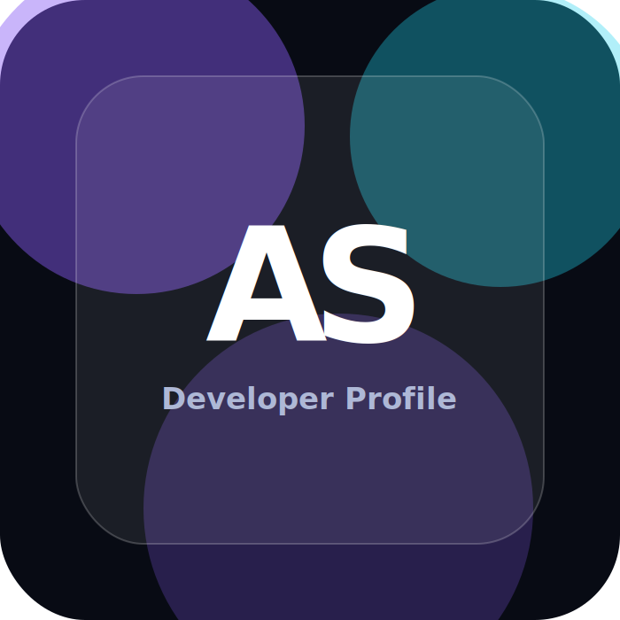

# Affan Shekha Profile Website

A responsive static profile website built with HTML, CSS, and JavaScript. It is ready to host on GitHub Pages.

## Files

- `index.html` - main website structure
- `styles.css` - responsive styling, layout, animations, theme support
- `script.js` - mobile menu, theme toggle, copy email, scroll reveal animations
- `assets/profile.svg` - default profile avatar placeholder
- `assets/Affan-Shekha-Resume.pdf` - downloadable resume

## Add your real profile picture

Replace `assets/profile.svg` with your real photo, or add a file named `profile.jpg` inside the `assets` folder and update this line in `index.html`:

```html

```

Change it to:

```html

```

## Host on GitHub Pages

1. Create a new GitHub repository.
2. Upload all files from this folder.
3. Go to repository `Settings` > `Pages`.
4. Under `Build and deployment`, choose `Deploy from a branch`.
5. Select `main` branch and `/root` folder.
6. Save. GitHub will publish the site URL.
